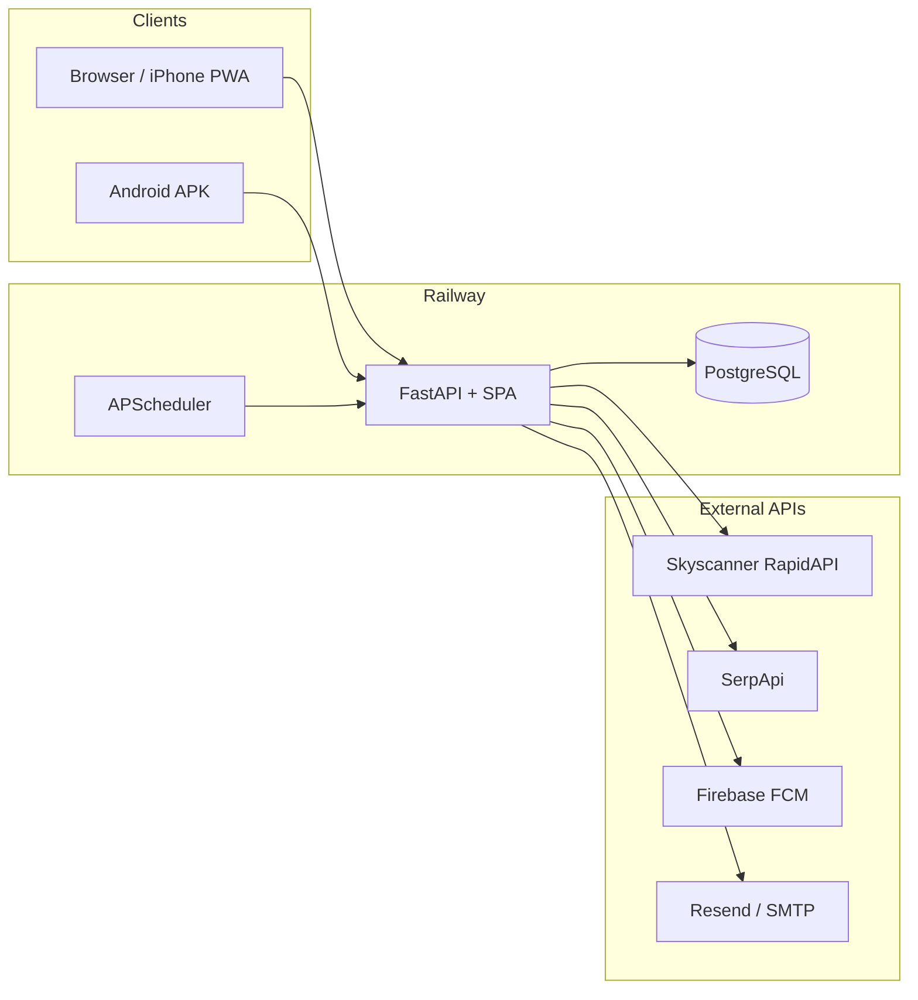

# Flight Price Tracker

A minimalist flight price tracker: save routes, compare live quotes from Skyscanner (RapidAPI) and SerpApi, get scheduled checks and drop alerts, and open booking links — on the web, iPhone (PWA), or Android (Capacitor).

**Live demo:** https://flightpricetracker-production.up.railway.app  
**Repository:** https://github.com/KrisiBoy/FlightPriceTracker

---

## Features

- **Multi-user auth** — JWT login; each user has private tracked routes
- **Live flight prices** — Skyscanner via RapidAPI + SerpApi fallback
- **Scheduled monitoring** — Server checks prices 3× daily (UTC 8 / 14 / 20)
- **Price-drop alerts** — Email (Resend/SMTP) and FCM push on Android
- **Currencies & stops** — USD, EUR, GBP, BGN, HUF, JPY; any / direct / connecting
- **Mobile** — Capacitor 7 Android APK; iPhone via Safari “Add to Home Screen” (no $99 Apple fee)
- **Single deploy** — Docker image serves FastAPI + built SPA on Railway

---

## Documentation

| Guide | Audience | Description |
|-------|----------|-------------|
| **[USER_GUIDE.md](USER_GUIDE.md)** | End users | Accounts, routes, refresh, notifications, iPhone & Android install |
| **[DEPLOY.md](DEPLOY.md)** | Self-hosters | Railway, PostgreSQL, env vars, verification |
| **[frontend/ANDROID_BUILD.txt](frontend/ANDROID_BUILD.txt)** | Developers | JDK, Android SDK, debug & release APK |
| **[frontend/IOS_BUILD.txt](frontend/IOS_BUILD.txt)** | iPhone users | Free PWA path; optional native iOS notes |
| **[frontend/FIREBASE_SETUP.txt](frontend/FIREBASE_SETUP.txt)** | Developers | `google-services.json` + Railway FCM JSON |

---

## Quick start (users)

1. **Browser or iPhone** — Open https://flightpricetracker-production.up.railway.app → register → add a route → **Refresh now**.  
   On iPhone: Safari → Share → **Add to Home Screen**.

2. **Android** — Build or install the release APK ([ANDROID_BUILD.txt](frontend/ANDROID_BUILD.txt)), allow notifications for push.

Full walkthrough: **[USER_GUIDE.md](USER_GUIDE.md)**

---

## Quick start (developers)

### Prerequisites

- Python 3.11+
- Node.js 20+
- Optional: Android Studio (APK), RapidAPI + SerpApi keys (live prices)

### Backend

```powershell
cd backend
python -m venv .venv
.\.venv\Scripts\Activate.ps1
pip install -r requirements.txt
uvicorn main:app --host 0.0.0.0 --port 8000 --reload
```

Uses SQLite by default (`backend/data/flight_tracker.db`). Copy `.env.example` patterns from [DEPLOY.md](DEPLOY.md) for API keys.

### Frontend

```powershell
cd frontend
npm install
npm run build
```

With the backend running, open http://localhost:8000 (serves the built SPA and `/api`).

Dev server with proxy:

```powershell
npm run dev
```

→ http://localhost:5173 (API proxied to port 8000)

### Android APK

```powershell
cd frontend
# Set production API in .env.production, then:
npm run cap:apk          # debug
npm run cap:apk:release  # release (push if google-services.json present)
```

Output: `frontend/android/app/build/outputs/apk/release/app-release.apk`

---

## Architecture



| Layer | Tech |
|-------|------|
| API | FastAPI, SQLModel, APScheduler, JWT |
| DB | SQLite (local) / PostgreSQL (production) |
| Web UI | Vite, Tailwind CSS |
| Mobile | Capacitor 7 (`@capacitor/android`, push plugin) |
| Deploy | Multi-stage Dockerfile → Railway |

---

## Environment variables (production)

Set on Railway (see [DEPLOY.md](DEPLOY.md) for full list):

| Variable | Purpose |
|----------|---------|
| `DATABASE_URL` | PostgreSQL from Railway plugin |
| `JWT_SECRET` | Long random string for tokens |
| `FLIGHT_API_MODE` | `live` for real prices, `mock` for testing |
| `RAPIDAPI_KEY` | Skyscanner on RapidAPI |
| `SERPAPI_KEY` | Google Flights via SerpApi |
| `FCM_CREDENTIALS_JSON` | Firebase service account (one-line JSON) for push |
| `RESEND_API_KEY` | Email alerts (optional) |
| `SCHEDULER_ENABLED` | `true` for automatic price checks |
| `SCHEDULER_HOURS` | UTC hours, default `8,14,20` |

Frontend production build:

```env
# frontend/.env.production
VITE_API_BASE_URL=https://your-service.up.railway.app/api
VITE_PUSH_NOTIFICATIONS_ENABLED=true   # only with google-services.json at build time
```

---

## API overview

| Method | Path | Auth | Description |
|--------|------|------|-------------|
| GET | `/api/health` | No | Health check |
| POST | `/api/auth/register` | No | Create account |
| POST | `/api/auth/login` | No | Get JWT |
| GET | `/api/tracks` | Yes | List your routes |
| POST | `/api/tracks` | Yes | Add route |
| POST | `/api/refresh` | Yes | Check all routes now |
| POST | `/api/devices/register` | Yes | Register FCM token (Android) |

Interactive docs (local): http://localhost:8000/docs

### Verify production

```powershell
python backend/scripts/smoke_test_production.py
python backend/scripts/smoke_test_skyscanner.py   # needs RAPIDAPI_KEY in .env
```

---

## Project layout

```
FlightPriceTracker/
├── backend/           # FastAPI app, models, flight APIs, scheduler, FCM
├── frontend/          # Vite SPA + Capacitor Android
├── Dockerfile         # Frontend build + Python runtime
├── DEPLOY.md
├── USER_GUIDE.md
└── README.md
```

---

## Deploy to Railway

1. Push this repo to GitHub.
2. Railway → **New Project** → **Deploy from GitHub** → select this repo.
3. Add **PostgreSQL**; link `DATABASE_URL`.
4. Set variables from [DEPLOY.md](DEPLOY.md).
5. Deploy — SPA at `https://<service>.up.railway.app`, API at `/api`.

---

## Security notes

- Never commit `.env`, `google-services.json`, or Firebase service account JSON.
- Rotate API keys if they were exposed in logs or chat.
- Use a strong `JWT_SECRET` in production.
- `CORS_ORIGINS=*` is convenient for development; tighten for production if needed.

---

## License

This project is provided as-is for personal use. Check third-party API terms (RapidAPI, SerpApi, Firebase, Resend) before commercial use.
